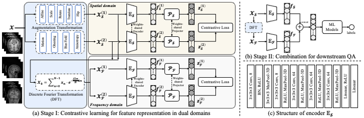

# MRIQA

Official code implementation of **Contrastive Representation in Spatial and Frequency Domains for No-Reference Magnetic Resonance Image Quality Assessment**

<div align=center></div>

## Requirements:
- numpy==1.23.4
- torch==1.13.1
- torchvision==0.14.1

## Data Preparation
```
MRIQA
    |_ *.py
    |_ label.csv
    |_ datasets
        |_ ds000030_R1.0.5
            |_ sub-10159
            |_ ...
            |_ sub-70086
        |_ ds000115_R2.0.0
            |_ sub-01
            |_ ...
            |_ sub-102
        |_ ds000158_R1.0.1
            |_ sub-001
            |_ ...
            |_ sub-217
        |_ ds000201_R1.0.5
            |_ sub-9001
            |_ ...
            |_ sub-9100
        |_ ds000202_R1.0.2
            |_ sub-1001
            |_ ...
            |_ sub-1095
        |_ ds000228_R1.0.1
            |_ sub-pixar001
            |_ ...
            |_ sub-pixar155
        |_ ds000243_R1.0.0
            |_ sub-001
            |_ ...
            |_ sub-120
        |_ ds000258_R1.0.0
            |_ sub-04570
            |_ ...
            |_ sub-21658
```

All these datasets can be obtained from the [OpenfMRI database](https://openfmri.org/), with accession number ds000030, ds000115, ds000158, ds000201, ds000202, ds000228, ds000243 and ds000258. 

`label.csv` will be released after the paper is accepted.


## Usage

### Stage I: (1) Data augmentation and Fourier transformation
Command to perform data augmentation and Fourier transform.
```
python transform.py
```

### Stage I: (2) Train representation learning
- For feature representation in SPATIAL domain:
```
python main.py --mode="augmentation" --batch_size=256 --projection_dim=128 --epochs=100 --learning_rate=0.001 --temperature=0.9
```

- For feature representation in FREQUENCY domain:
```
python main.py --mode="fourier" --batch_size=256 --projection_dim=128 --epochs=100 --learning_rate=0.001 --temperature=0.9
```

Feel free to change the value of batch size and projection dimention.

### Stage II: Combination for downstream QA
Command to conduct quality and representation assessment:
- For SPATIAL domain representations:
```
python assessment.py --mode="augmentation"  --batch_size=256 --projection_dim=128
```
- For FREQUENCY domain representations:
```
python assessment.py --mode="fourier"  --batch_size=256 --projection_dim=128
```
- For DUAL domain representations:
```
python assessment.py --mode="combined"  --batch_size=256 --projection_dim=128
```
